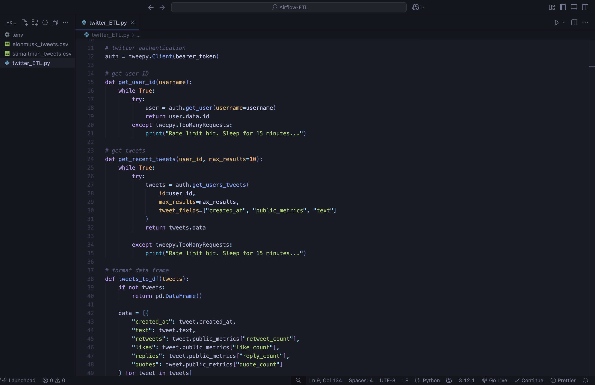

# Twitter Data Pipeline with Apache Airflow on AWS

This project demonstrates an end-to-end ETL pipeline built with Apache Airflow on an AWS EC2 instance, used to extract tweets from Twitter via Tweepy, process them using Pandas, and store the results in Amazon S3.

### Project Overview

*The goal of this project is to automate the collection and storage of real-time Twitter data using a scheduled workflow managed by Apache Airflow.*

- **Twitter API Integration:** Fetches tweets using Tweepy for a given username

- **ETL Workflow with Airflow:** The DAG handles extraction using Twitter API, transformation using Pandas, and loads the data into AWS S3.

- **Cloud Hosted:** Deployed on an AWS EC2 instance running Airflow and Python.

- **Cloud Storage:** Cleaned tweet data is saved as CSV files in an Amazon S3 bucket.

- **Automation:** Airflow handles task scheduling, retries, and monitoring.



*twitter_ETL.py*


### Tools and Technologies

| Tool         | Purpose                                                   |
|--------------|-----------------------------------------------------------|
| AWS EC2      | Cloud virtual machine for hosting the Airflow environment |
| Apache Airflow | Orchestrates and schedules the ETL pipeline             |
| Tweepy       | Connects to the Twitter API to extract tweet data         |
| Pandas       | Transforms and cleans tweet data                          |
| Amazon S3    | Stores the final output CSVs for further use              |

### Pipeline Workflow

**(1)** Extraction:

- Uses Tweepy to collect tweets from a given twitter username.

- Collects metadata like tweet text, timestamp, retweets, likes etc.

**(2)** Transformation:

- The JSON data is loaded into a Pandas DataFrame.

- Performs cleaning and fixes the data

**(3)** Loading:

- The cleaned data is exported as a CSV file.

- CSV is uploaded to a specified S3 bucket using boto3.

**(4)** Orchestration:

- A DAG is configured to run the ETL script at regular intervals.

- Each step of the ETL is logged and monitored via the Airflow web UI.

### Setting up the project in your machine

#### Prerequisites
- Python 

- Apache Airflow 

- pip 

- AWS account with an S3 bucket

- Twitter Developer account and app credentials

#### clone the repository

```
git clone https://github.com/555aaditya/Twitter-ETL.git
cd Twitter-ETL
```

#### Install dependencies
```
pip install -r requirements.txt
```

#### Get your Bearer Token
Go to https://developer.x.com/en and start a new project and copy your Bearer Token

#### Configure your Bearer Token
Create a ```.env``` file at your root directory and configure your Bearer Token from the twitter API
```
BEARER_TOKEN = <your-bearer-token>
```
Connect this to your ```twitter_ETL.py``` file 

#### Launch EC2 instance
- Go to EC2 Dashboard > Launch Instance

- Choose an Amazon Linux 2 or Ubuntu 20.04 AMI

- Select instance type usually t2.micro for free tier

- Create or select a key pair and save the .pem file

- Open ports 22 (SSH) and 8080 (Airflow Web UI) in the Security Group

#### Connect to EC2
```
chmod 400 your-key.pem
ssh -i your-key.pem ec2-user@your-ec2-public-ip
```

#### Install Dependencies 
```
sudo yum update && sudo yum upgrade -y  
sudo yum install python3-pip python3-venv unzip -y
pip3 install apache-airflow boto3 tweepy
```

#### Launch S3 bucket
- Go to S3 Console

- Click Create Bucket

- Name: your-twitter-bucket

- Region: same as EC2

- Disable "Block all public access" 

#### Create Airflow files on EC2
```
mkdir dags
cd dags
sudo nano twitter_ETL.py
```
Copy the ```twitter_ETL.py``` to your nano file and save it

```
sudo nano twitter_DAG.py
```
copy the ```twitter_DAG.py``` to your nano file and save it

#### Launch Airflow Webserver and Scheduler
```
airflow webserver --port 8080
airflow scheduler
```

#### Start Airflow webserver
visit ```http://<your-ec2-public-ip>:8080```
and run the DAG on the webserver

#### Check S3 bucket for new files
visit your S3 bucket and check for the csv files containing the tweets for the provided username

#### Stopping the Program

| **Action**                  | **Command**                                             |
|-----------------------------|---------------------------------------------------------------------|
| **Stop Airflow Web Server** | Press `CTRL+C` in the terminal running the web server               |
| **Stop Airflow Scheduler**  | Press `CTRL+C` in the terminal running the scheduler                |

